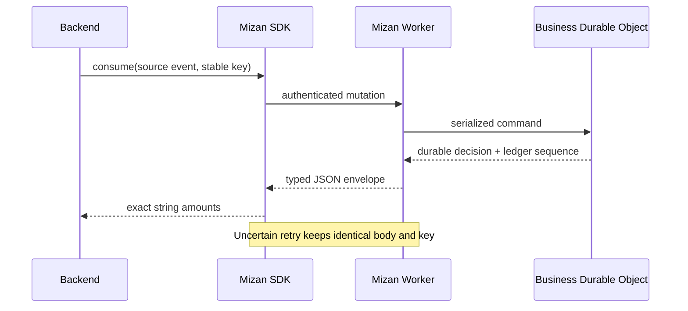

# Mizan client SDKs

Official, server-side Python and Go clients for the Mizan billing and metering API. The repository is
owned and released under `alshell7`. Both libraries are dependency-light, preserve exact amounts, and
retry uncertain mutations only with the original body and idempotency key.

| SDK | Install | Runtime | Local release gate |
|---|---|---|---|
| Python | `pip install mizan-billing` | Python 3.10+ | `python -m unittest discover -s tests -v` |
| Go | `go get github.com/alshell7/mizan-client-sdks/mizan-go` | Go 1.22+ | `go test ./... && go vet ./...` |

The package name is `mizan-billing`; the Python import is `mizan`. The Go module is
`github.com/alshell7/mizan-client-sdks/mizan-go`.

Template activations use `plan_id`. When an operator has approved a business-specific plan through the Mizan
admin API/UI, use `plan_configuration_id` instead. Send exactly one of those fields. Delivery endpoint and plan
approval operations require a separate admin credential. `MizanAdminClient` (Python) and `AdminClient` (Go)
expose global and per-business delivery configuration, add-on rollout governance, and paginated operational reads
without mixing admin credentials into runtime clients.

Before a UI submits consumption, funding, refund, promotional grant, or feature-budget changes, call the read-only
balance impact preview. It returns exact `before`, `delta`, and `after` values and an advisory eligibility decision;
the eventual mutation remains authoritative and still needs its own idempotency key.

## Feature-specific consumption

Every catalog feature has a distinct exported Python `TypedDict`, Go struct, validated builder/method, and test
case. Count-priced contracts accept only whole positive quantities and default to `"1"`; provider-normalized
telephony minutes retain milli precision. Duration and pass-through amount contracts never invent a quantity.
`conversation_24h` reports the stable conversation ID and channel on every activity event so Mizan can open and
deduplicate fixed windows. `ai_assist_action_over_allowance` reports every AI-assist action; Mizan applies the
snapshotted monthly allowance and returns the included and billable quantities.

| Feature code | Python contract | Go contract |
|---|---|---|
| `conversation_24h` | `Conversation24HConsumptionRequest` | `Conversation24HUsage` |
| `outbound_delivered_message` | `OutboundDeliveredMessageConsumptionRequest` | `OutboundDeliveredMessageUsage` |
| `ai_assist_action_over_allowance` | `AIAssistActionConsumptionRequest` | `AIAssistActionUsage` |
| `voice_ai_started_minute` | `VoiceAIStartedMinuteConsumptionRequest` | `VoiceAIStartedMinuteUsage` |
| `ai_reply_handling` | `AIReplyHandlingConsumptionRequest` | `AIReplyHandlingUsage` |
| `whatsapp_meta_marketing_msg` | `WhatsAppMetaMarketingMessageConsumptionRequest` | `WhatsAppMetaMarketingMessageUsage` |
| `telephony_voice_minute` | `TelephonyVoiceMinuteConsumptionRequest` | `TelephonyVoiceMinuteUsage` |
| `inbound_voice_minute` | `InboundVoiceMinuteConsumptionRequest` | `InboundVoiceMinuteUsage` |
| `other_provider_charge` | `OtherProviderChargeConsumptionRequest` | `OtherProviderChargeUsage` |

The Meta contract fixes the provider to `Meta`. Telephony contracts require provider-normalized billable minutes
plus the provider/event identity. Pass-through charges require an exact settlement amount in halala plus provider
invoice, original amount/currency, and tariff evidence; non-SAR originals also require a versioned FX rule.

Provider metadata may also include the provider invoice, original amount/currency, FX rule, tariff version,
channel account, conversation, campaign, and small scalar application attributes.

## Safety contract

- Money is a base-10 integer halala string: `"75"` is SAR 0.75.
- Azeer Units are a base-10 integer milliunit string: `"500"` is 0.5 unit.
- Do not use `float` or `float64` for amounts.
- The Worker is authoritative for catalog prices, VAT, discounts, budgets, eligibility, and lot allocation.
- The active subscription snapshot freezes feature prices and tax policy; SDK callers never calculate either.
- A `source_event_id` is one atomic billing decision. Put all related feature components in its first request; it
  cannot be reused later to add another charge.
- `occurred_at` must be non-future and inside the currently open subscription month. Queue and deliver usage before
  that month closes; older paid-period events are rejected deterministically.
- Choose an idempotency key per business operation and store it with the source event.
- On a transport/protocol error, the mutation outcome may be unknown. Retry only with the exception's/key's
  original idempotency key and identical request.
- Tokens are server credentials. Never ship them to browsers, mobile applications, logs, or analytics. Production
  services receive a business-scoped token whose business must match the route; the platform-wide compatibility
  token is only for an explicitly trusted platform principal.

## Repository layout

- [`mizan-python`](mizan-python/README.md): typed dictionaries, typed response envelopes, standard-library HTTP.
- [`mizan-go`](mizan-go/README.md): typed request/result structs, contexts, standard-library HTTP.
- [Python end-to-end examples](mizan-python/examples/README.md): activation through ledger export plus a durable FastAPI receiver.
- [Go end-to-end examples](mizan-go/examples/README.md): activation through ledger export plus a durable `net/http` receiver.
- [Webhook consumption guide](WEBHOOKS.md): ledger and notification contracts, identifiers, retries, Go Fiber, and FastAPI.
- [Publishing guide](PUBLISHING.md): GitHub tags, PyPI trusted publishing, and Go module releases.

CI tests Python 3.10–3.13 and Go 1.22–1.23. Dependabot covers Python, Go, and GitHub Actions.
