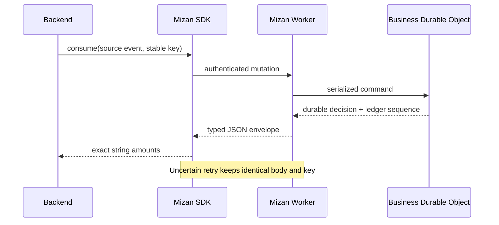

# Mizan client SDKs

Official, server-side Python and Go clients for the Mizan billing and metering API. The repository is
owned and released under `alshell7`. Both libraries are dependency-light, preserve exact amounts, and
retry uncertain mutations only with the original body and idempotency key.

| SDK | Install | Runtime | Local release gate |
|---|---|---|---|
| Python | `pip install mizan-billing` | Python 3.10+ | `python -m unittest discover -s tests -v` |
| Go | `go get github.com/alshell7/mizan-client-sdks/mizan-go` | Go 1.22+ | `go test ./... && go vet ./...` |

The package name is `mizan-billing`; the Python import is `mizan`. The Go module is
`github.com/alshell7/mizan-client-sdks/mizan-go`.

## Safety contract

- Money is a base-10 integer halala string: `"75"` is SAR 0.75.
- Azeer Units are a base-10 integer milliunit string: `"500"` is 0.5 unit.
- Do not use `float` or `float64` for amounts.
- The Worker is authoritative for catalog prices, VAT, discounts, budgets, eligibility, and lot allocation.
- Choose an idempotency key per business operation and store it with the source event.
- On a transport/protocol error, the mutation outcome may be unknown. Retry only with the exception's/key's
  original idempotency key and identical request.
- Tokens are server credentials. Never ship them to browsers, mobile applications, logs, or analytics.

## Repository layout

- [`mizan-python`](mizan-python/README.md): typed dictionaries, typed response envelopes, standard-library HTTP.
- [`mizan-go`](mizan-go/README.md): typed request/result structs, contexts, standard-library HTTP.
- [Publishing guide](PUBLISHING.md): GitHub tags, PyPI trusted publishing, and Go module releases.

CI tests Python 3.10–3.13 and Go 1.22–1.23. Dependabot covers Python, Go, and GitHub Actions.
