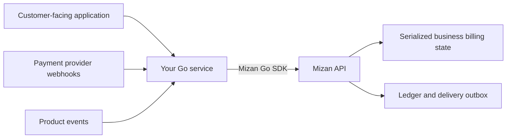
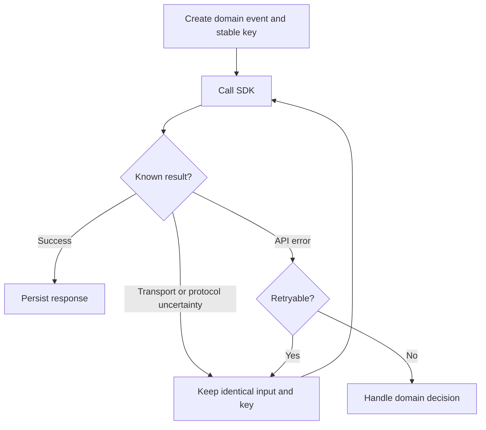
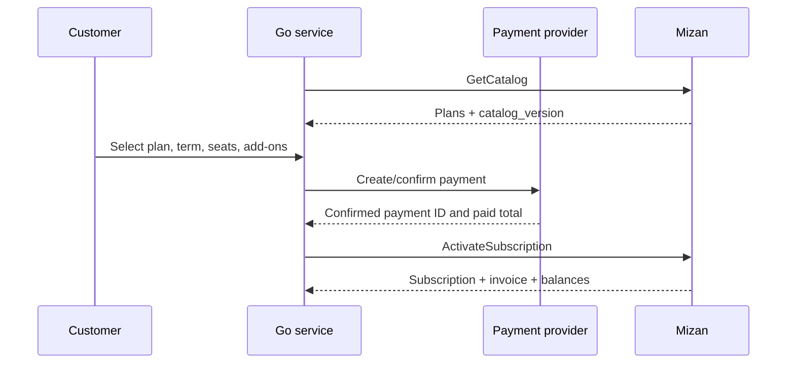
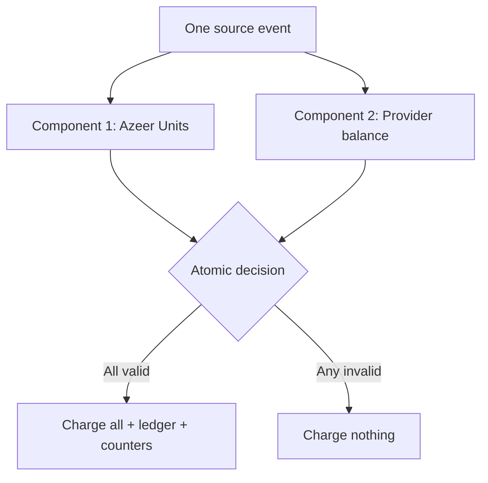
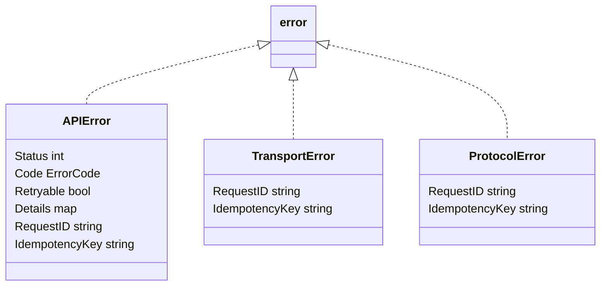

# Mizan Go SDK

The Mizan Go SDK is a standard-library-only, server-side client for Mizan billing. It requires Go 1.22 or newer.

It helps you:

- manage subscription activation, changes, cancellation, and renewal;
- check plan entitlements and usage eligibility;
- record billable usage atomically;
- fund Azeer Units and provider balances;
- configure budgets and read financial history;
- use typed constants instead of guessing API values;
- safely handle retries, unknown outcomes, and domain errors.

## Contents

- [How Mizan fits into your service](#how-mizan-fits-into-your-service)
- [Install](#install)
- [Configure the client](#configure-the-client)
- [Important concepts](#important-concepts)
- [Scenario 1: load the catalog and allowed values](#scenario-1-load-the-catalog-and-allowed-values)
- [Scenario 2: activate a subscription](#scenario-2-activate-a-subscription)
- [Scenario 3: change, cancel, or renew a subscription](#scenario-3-change-cancel-or-renew-a-subscription)
- [Scenario 4: check entitlement and eligibility](#scenario-4-check-entitlement-and-eligibility)
- [Scenario 5: record usage](#scenario-5-record-usage)
- [Scenario 6: top-ups and refunds](#scenario-6-top-ups-and-refunds)
- [Scenario 7: budgets](#scenario-7-budgets)
- [Scenario 8: summaries and ledger export](#scenario-8-summaries-and-ledger-export)
- [Error handling and retries](#error-handling-and-retries)
- [Production checklist](#production-checklist)

## How Mizan fits into your service

Call Mizan from trusted backend code. Never place the API token in browser, mobile, or customer-controlled code.



Your service supplies facts, such as a confirmed payment or completed billable action. Mizan makes the authoritative decision and commits the related balances, counters, ledger entries, and delivery records together.

## Install

```bash
go get github.com/alshell7/mizan-client-sdks/mizan-go@v1.3.0
```

The module is stored in a repository subdirectory, so repository release tags use `mizan-go/v1.3.0`.

Import it with:

```go
import mizan "github.com/alshell7/mizan-client-sdks/mizan-go"
```

## Configure the client

```go
package billing

import (
	"log"
	"os"
	"time"

	mizan "github.com/alshell7/mizan-client-sdks/mizan-go"
)

func NewMizanClient() *mizan.Client {
	client, err := mizan.NewClient(
		os.Getenv("MIZAN_BASE_URL"),
		os.Getenv("MIZAN_API_TOKEN"),
	)
	if err != nil {
		log.Fatalf("configure Mizan: %v", err)
	}

	client.HTTPClient.Timeout = 10 * time.Second
	client.MaxAttempts = 3
	return client
}
```

| Setting | Meaning | Recommended production value |
|---|---|---|
| `BaseURL` | Mizan environment URL | Environment configuration |
| `Token` | Bearer API token | Secret manager value |
| `HTTPClient.Timeout` | Maximum duration of one HTTP attempt | About 10 seconds |
| `MaxAttempts` | Maximum attempts for retryable mutations | `3` |
| `Logger` | Optional structured SDK logger | Redacting application logger |

The client automatically adds authorization, request timestamp, request ID, business scope, content type, user agent, and mutation idempotency headers.

### Use request contexts

Use a context deadline that is appropriate for the calling operation.

```go
ctx, cancel := context.WithTimeout(context.Background(), 15*time.Second)
defer cancel()

summary, err := client.GetBillingSummary(ctx, "business-123")
```

An expired context stops the caller from waiting. For mutations, the remote outcome can still be unknown, so preserve and retry with the same idempotency key.

### Optional structured logging

```go
client.Logger = func(event string, fields map[string]any) {
	// Do not add the token or unrestricted request bodies.
	slog.Info("Mizan SDK", "event", event, "fields", fields)
}
```

## Important concepts

### Use typed constants

```go
plan := mizan.PlanStart
term := mizan.TermMonthly
feature := mizan.FeatureOutboundDeliveredMessage
channel := mizan.ChannelWhatsApp
action := mizan.BudgetPause
```

The SDK defines types and constants for plans, terms, features, add-ons, currencies, payment/refund statuses, budget fields, channels, capabilities, and error codes.

Helper functions are available when building application controls:

```go
plans := mizan.AllPlanIDs()
terms := mizan.AllBillingTerms()
features := mizan.AllFeatureCodes()
channels := mizan.AllChannels()
```

The live catalog also contains `contract_values`. Use the live catalog for server-driven controls that must update without recompiling your application.

### Exact values

Mizan never relies on JSON floating-point values for financial or unit accounting.

| Name or suffix | Unit | Go type | Example |
|---|---|---|---|
| `_minor` | Integer halala | `mizan.ExactAmount` | `"75"` = SAR 0.75 |
| `_millis` | Azeer milliunit | `mizan.ExactAmount` | `"500"` = 0.5 Azeer Unit |
| quantity | Exact decimal string | `string` | `"1.250"` |
| `_bps` | Basis points | `int` | `1500` = 15% |

Do not parse `ExactAmount` through `float64`. Use integer or decimal-safe presentation logic outside the billing request.

### Idempotency keys

An idempotency key identifies one business operation, not one HTTP attempt.

Examples:

- `activate:business-123:checkout-001`
- `renew:business-123:invoice-2026-08`
- `consume:message-delivered-001`
- `provider-topup:payment-001`



If you reuse a key with different input, Mizan returns `IDEMPOTENCY_KEY_REUSED` and rejects the second operation.

## Scenario 1: load the catalog and allowed values

Fetch the catalog before presenting subscription choices or constructing activation/change requests.

```go
response, err := client.GetCatalog(ctx)
if err != nil {
	return fmt.Errorf("get Mizan catalog: %w", err)
}

catalogVersion, _ := response["catalog_version"].(string)
plans, _ := response["plans"].(map[string]any)
contractValues, _ := response["contract_values"].(map[string]any)

fmt.Println(catalogVersion)
fmt.Println(plans["start"])
fmt.Println(contractValues["feature_codes"])
```

`Response` is a forward-compatible `map[string]any`. The catalog is intentionally dynamic. Save `catalog_version` with checkout or change state so stale pricing fails safely.

## Scenario 2: activate a subscription

Activate once for a business, after the trusted checkout flow has a confirmed payment and exact Mizan invoice total.



```go
businessID := "business-123"
paymentEventID := "checkout-session-001"

request := mizan.ActivationRequest{
	CatalogVersion: catalogVersion,
	PlanID:         mizan.PlanStart,
	Term:           mizan.TermMonthly,
	Seats:          1,
	Timezone:       "Asia/Riyadh",
	PaymentStatus:  mizan.PaymentConfirmed,
	PaymentEventID: paymentEventID,
	Currency:       mizan.CurrencySAR,
	PaidTotalMinor: mizan.ExactAmount("25300"), // Authoritative checkout total.
}

response, err := client.ActivateSubscription(
	ctx,
	businessID,
	request,
	"activate:"+businessID+":"+paymentEventID,
)
if err != nil {
	return fmt.Errorf("activate subscription: %w", err)
}

activation, err := mizan.DecodeData[mizan.ActivationResult](response)
if err != nil {
	return fmt.Errorf("decode activation: %w", err)
}

fmt.Println(activation.SubscriptionID)
fmt.Println(activation.Invoice.TotalMinor)
fmt.Println(activation.Balances.AzeerUnitMillis)
```

Never accept `PaidTotalMinor` or `Currency` directly from an untrusted client. They must match the trusted checkout and Mizan invoice.

When add-ons are selected, include `[]mizan.RecurringAddon` values before creating the payment. Use typed constants such as `mizan.AddonCSATStart`; the paid total must cover the full plan, seat, term, and add-on selection.

For a reviewed business-specific plan, leave `PlanID` empty and set
`PlanConfigurationID: "<approved immutable ID>"`. Set exactly one of the two fields. Obtain the exact invoice from
the trusted admin quote flow before taking payment; never accept a plan configuration ID or paid total from an
untrusted client.

| Error | Meaning | What to do |
|---|---|---|
| `STALE_PLAN_VERSION` | Catalog changed during checkout | Reload catalog and restart/reconfirm checkout |
| `PAYMENT_AMOUNT_MISMATCH` | Paid total/currency differs | Stop and reconcile payment |
| `DUPLICATE_PAYMENT_EVENT` | Provider event was already used | Load current state instead of paying again |
| `IDEMPOTENCY_KEY_REUSED` | Key was used with different input | Investigate the conflicting caller |

## Scenario 3: change, cancel, or renew a subscription

### Schedule a change

Changes take effect at renewal and do not prorate the active period.

```go
_, err := client.ChangeSubscription(ctx, businessID, mizan.SubscriptionChangeRequest{
	CatalogVersion: catalogVersion,
	PlanID:         mizan.PlanGrowth,
	Term:           mizan.TermAnnual,
	Seats:          5,
	RequestedBy:    "owner@example.com",
	Reason:         "Annual upgrade",
}, "change:business-123:annual-upgrade-001")
if err != nil {
	return fmt.Errorf("schedule subscription change: %w", err)
}
```

Only one change can be pending. Handle `SUBSCRIPTION_CHANGE_PENDING` by showing or reviewing the existing change.

### Schedule cancellation

```go
_, err := client.CancelSubscription(ctx, businessID, mizan.CancellationRequest{
	EventID: "customer-cancel-001",
	Reason:  "Customer request",
}, "cancel:business-123:customer-cancel-001")
```

This keeps access active through the paid period. Immediate cancellation belongs to the audited admin workflow.

### Apply a failed renewal

```go
_, err := client.ApplyRenewalEvent(ctx, businessID, mizan.RenewalEventRequest{
	PaymentEventID: "renewal-provider-event-001",
	PaymentStatus:  mizan.PaymentFailed,
}, "renew:renewal-provider-event-001")
```

A failed renewal moves the subscription to `past_due`. Do not send currency or a paid total for a failed payment.

### Apply a confirmed renewal

```go
_, err := client.ApplyRenewalEvent(ctx, businessID, mizan.RenewalEventRequest{
	PaymentEventID: "renewal-provider-event-002",
	PaymentStatus:  mizan.PaymentConfirmed,
	Currency:       mizan.CurrencySAR,
	PaidTotalMinor: mizan.ExactAmount("25300"),
}, "renew:renewal-provider-event-002")
```

The exact total must include any scheduled plan, term, seat, or add-on change.

## Scenario 4: check entitlement and eligibility

| Check | Question | Changes state? | Typical use |
|---|---|---:|---|
| `GetEntitlement` | Does the subscription include this capability? | No | Show/enable a product feature |
| `CheckEligibility` | Would this usage likely be allowed now? | No | UI/service preflight |
| `Consume` | Is this usage allowed and should it be charged? | Yes | Final billable event |

### Entitlement

```go
response, err := client.GetEntitlement(
	ctx,
	businessID,
	mizan.CapabilityAdvancedAnalytics,
)
if err != nil {
	return err
}

entitlement, err := mizan.DecodeData[mizan.EntitlementResult](response)
if err != nil {
	return err
}

if entitlement.Enabled {
	enableAdvancedAnalytics()
}
```

### Eligibility preview

```go
preview, err := client.CheckEligibility(
	ctx,
	businessID,
	mizan.FeatureOutboundDeliveredMessage,
	mizan.EligibilityRequest{
		Quantity: "1",
		Metadata: &mizan.UsageMetadata{Channel: mizan.ChannelWhatsApp},
	},
)
```

Eligibility expires quickly and does not reserve funds. Always call `Consume` when billable work occurs.

## Scenario 5: record usage

### One feature

```go
sourceEventID := "message-delivered-001"

response, err := client.Consume(ctx, businessID, mizan.ConsumptionRequest{
	SourceEventID: sourceEventID,
	OccurredAt:    time.Now().UTC(),
	FeatureCode:   mizan.FeatureOutboundDeliveredMessage,
	Quantity:      "1",
	Metadata: &mizan.UsageMetadata{
		Channel:         mizan.ChannelWhatsApp,
		Provider:        "meta",
		ProviderEventID: "meta-message-001",
		ConversationID:  "conversation-123",
	},
}, "consume:"+sourceEventID)
if err != nil {
	return fmt.Errorf("consume usage: %w", err)
}

decision, err := mizan.DecodeData[mizan.ConsumptionResult](response)
if err != nil {
	return fmt.Errorf("decode consumption: %w", err)
}

fmt.Println(decision.Accepted)
fmt.Println(decision.Charges)
fmt.Println(decision.Balances.AzeerUnitMillis)
```

Derive `SourceEventID` from your own durable event. It adds domain-level deduplication in addition to the HTTP idempotency key.

### Multiple components

Use components when one product event creates several related charges. Mizan accepts or rejects all components together.

```go
response, err := client.Consume(ctx, businessID, mizan.ConsumptionRequest{
	SourceEventID: "campaign-delivery-001",
	OccurredAt:    time.Now().UTC(),
	Components: []mizan.ConsumptionComponent{
		{
			FeatureCode: mizan.FeatureOutboundDeliveredMessage,
			Quantity:    "1",
			Metadata: &mizan.UsageMetadata{
				Channel:         mizan.ChannelWhatsApp,
				ProviderEventID: "meta-delivery-001",
			},
		},
		{
			FeatureCode:         mizan.FeatureWhatsAppMetaMarketingMessage,
			Quantity:            "1",
			ProviderAmountMinor: mizan.ExactAmount("25"),
			Metadata: &mizan.UsageMetadata{
				Channel:         mizan.ChannelWhatsApp,
				ProviderEventID: "meta-charge-001",
			},
		},
	},
}, "consume:campaign-delivery-001")
```



Metadata is for traceability and deduplication. Do not store secrets or unrestricted provider payloads in it.

## Scenario 6: top-ups and refunds

| Rail | Pays for | SDK method |
|---|---|---|
| Azeer Units | Mizan-metered product usage | `TopUpAzeerUnits` |
| Provider balance | Third-party/provider charges | `TopUpProviderBalance` |

### Confirmed provider-balance top-up

`NewConfirmedTopUp` fills the confirmed status and SAR currency. You supply the exact principal and trusted paid total.

```go
topUp := mizan.NewConfirmedTopUp(
	mizan.ExactAmount("10000"),
	"provider-payment-001",
	mizan.ExactAmount("11500"),
)

_, err := client.TopUpProviderBalance(
	ctx,
	businessID,
	topUp,
	"provider-topup:provider-payment-001",
)
```

Use `TopUpAzeerUnits` only with a package amount returned by the current catalog.

### Confirmed provider refund

```go
refund := mizan.ProviderRefundRequest{
	AmountMinor:        mizan.ExactAmount("1000"),
	PaymentEventID:     "provider-refund-001",
	RefundStatus:       mizan.RefundConfirmed,
	Currency:           mizan.CurrencySAR,
	RefundedTotalMinor: mizan.ExactAmount("1000"),
	Reason:             "Unused provider funds",
}

_, err := client.RefundProviderBalance(
	ctx,
	businessID,
	refund,
	"provider-refund:provider-refund-001",
)
```

Refunds create immutable reversals; they do not edit original funding entries.

## Scenario 7: budgets

Budgets apply to one feature for one subscription month.

| Metric | Measures |
|---|---|
| `BudgetAzeerUnitMillis` | Azeer milliunits |
| `BudgetMoneyMinor` | Integer halala |
| `BudgetQuantity` | Exact event quantity |

| Action | Behavior at limit |
|---|---|
| `BudgetAlert` | Report breach and allow usage |
| `BudgetPause` | Reject crossing usage and pause feature |

```go
budget := mizan.NewBudget(
	mizan.BudgetAzeerUnitMillis,
	mizan.ExactAmount("500000"),
	mizan.BudgetPause,
)
budget.WarningBPS = 8000 // Warn at 80%.

_, err := client.SetFeatureBudget(
	ctx,
	businessID,
	mizan.FeatureOutboundDeliveredMessage,
	budget,
	"budget:business-123:outbound-delivered-message:v1",
)
```

For sensitive provider-priced features, set `Sensitive`, `AbsoluteReserve`, and/or `ReserveBPS` explicitly.

## Scenario 8: summaries and ledger export

### Billing summary

```go
response, err := client.GetBillingSummary(ctx, businessID)
if err != nil {
	return err
}

summary, err := mizan.DecodeData[mizan.BillingSummaryResult](response)
if err != nil {
	return err
}

fmt.Println(summary.Subscription)
fmt.Println(summary.Balances)
fmt.Println(summary.CreditLots)
fmt.Println(summary.Budgets)
fmt.Println(summary.Replication)
```

Use the summary for customer billing screens and support tools. Do not reconstruct current balances by replaying the ledger on a request path.

### Ledger pagination

```go
var after int64

for {
	response, err := client.GetLedger(ctx, businessID, after, 100)
	if err != nil {
		return err
	}

	page, err := mizan.DecodeData[mizan.LedgerResult](response)
	if err != nil {
		return err
	}

	for _, entry := range page.Entries {
		if err := exportEntry(entry); err != nil {
			return err
		}
	}

	if page.NextAfterSequence == nil || *page.NextAfterSequence == after {
		break
	}
	after = *page.NextAfterSequence
}
```

Persist the last successfully exported business sequence in the downstream system so the process is restartable.

## Error handling and retries

### Error types



| Error type | Meaning | Recommended handling |
|---|---|---|
| `*mizan.APIError` | Structured Mizan API/domain error | Inspect code, details, and retryability |
| `mizan.DomainError` sentinel | Known error code usable with `errors.Is` | Handle the specific scenario |
| `*mizan.TransportError` | Network outcome is unknown | Retry identical input and key |
| `*mizan.ProtocolError` | Invalid or oversized response | Preserve key, alert, investigate |

```go
response, err := client.Consume(ctx, businessID, request, idempotencyKey)
if err != nil {
	switch {
	case errors.Is(err, mizan.ErrInsufficientAzeerUnits):
		return showTopUpRequired()
	case errors.Is(err, mizan.ErrInsufficientProviderBalance):
		return pauseProviderWorkAndNotifyFinance()
	case errors.Is(err, mizan.ErrFeaturePausedBudget):
		return showBudgetLimitReached()
	case errors.Is(err, mizan.ErrPaymentAmountMismatch):
		return alertPaymentReconciliation(err)
	}

	var apiErr *mizan.APIError
	var transportErr *mizan.TransportError
	var protocolErr *mizan.ProtocolError

	switch {
	case errors.As(err, &apiErr):
		if apiErr.Retryable {
			return scheduleIdenticalRetry(apiErr.IdempotencyKey)
		}
		return recordBusinessFailure(apiErr.Code, apiErr.Details, apiErr.RequestID)
	case errors.As(err, &transportErr):
		// The request may already have committed. Never create a new key/input.
		return scheduleIdenticalRetry(transportErr.IdempotencyKey)
	case errors.As(err, &protocolErr):
		return alertIntegrationFailure(protocolErr.RequestID, protocolErr.IdempotencyKey)
	default:
		return err
	}
}

_ = response
```

The SDK retries retryable mutation failures and transport failures up to `MaxAttempts`. It reuses the exact encoded request and idempotency key. Read-only calls are not retried after uncertain transport failures by default.

### Common error decisions

| Error code | Retry unchanged? | Typical response |
|---|---:|---|
| `INTERNAL_RETRYABLE` | Yes | Let SDK retry; alert if exhausted |
| `DEPENDENCY_TEMPORARILY_UNAVAILABLE` | Yes when retryable | Back off with same key |
| `INVALID_REQUEST` | No | Fix request validation |
| `PAYMENT_AMOUNT_MISMATCH` | No | Reconcile payment and invoice |
| `INSUFFICIENT_AZEER_UNITS` | No | Ask customer to top up |
| `INSUFFICIENT_PROVIDER_BALANCE` | No | Fund provider balance |
| `FEATURE_PAUSED_BUDGET` | No | Review budget or wait for reset |
| `STALE_PLAN_VERSION` | No | Reload catalog and restart workflow |
| `IDEMPOTENCY_KEY_REUSED` | No | Investigate conflicting callers |

## Working with responses

Top-level responses use `mizan.Response`, a forward-compatible map. Known `data` models can be decoded safely:

```go
activation, err := mizan.DecodeData[mizan.ActivationResult](response)
decision, err := mizan.DecodeData[mizan.ConsumptionResult](response)
entitlement, err := mizan.DecodeData[mizan.EntitlementResult](response)
summary, err := mizan.DecodeData[mizan.BillingSummaryResult](response)
ledger, err := mizan.DecodeData[mizan.LedgerResult](response)
```

`DecodeData` uses JSON marshaling internally and preserves `ExactAmount` strings.

## Method reference

| SDK method | Use it when | Mutation? |
|---|---|---:|
| `GetCatalog` | Loading commercial choices and allowed values | No |
| `ActivateSubscription` | Creating the first paid subscription | Yes |
| `ChangeSubscription` | Scheduling a next-renewal change | Yes |
| `CancelSubscription` | Scheduling period-end cancellation | Yes |
| `ApplyRenewalEvent` | Processing a confirmed/failed renewal | Yes |
| `TopUpAzeerUnits` | Purchasing a catalog unit package | Yes |
| `TopUpProviderBalance` | Funding third-party costs | Yes |
| `RefundProviderBalance` | Recording a confirmed provider refund | Yes |
| `SetFeatureBudget` | Setting monthly alert/pause behavior | Yes |
| `CheckEligibility` | Previewing whether usage is possible | No |
| `GetEntitlement` | Checking a plan capability | No |
| `Consume` | Recording the authoritative billable event | Yes |
| `GetBillingSummary` | Reading current account state | No |
| `GetLedger` | Exporting immutable financial history | No |

## Production checklist

- [ ] Call the SDK only from trusted server-side code.
- [ ] Keep tokens in a secret manager and separate environments.
- [ ] Use contexts with deliberate deadlines.
- [ ] Fetch and persist `catalog_version` for checkout/change workflows.
- [ ] Use typed SDK constants or live `contract_values`.
- [ ] Keep financial/unit values as `ExactAmount`; avoid `float64`.
- [ ] Derive stable idempotency keys from durable domain events.
- [ ] Retry mutations only with identical input and the same key.
- [ ] Persist provider/source event IDs for reconciliation.
- [ ] Treat eligibility as advisory; use consumption for final billing.
- [ ] Log request ID, business ID, operation, and key—never the token.
- [ ] Alert on exhausted retries, protocol errors, and replication lag.
- [ ] Test insufficient balances, duplicate events, stale catalog, and timeouts.

## Test the SDK

```bash
go test ./...
go vet ./...
```

Linux CI should also run:

```bash
go test -race ./...
```
