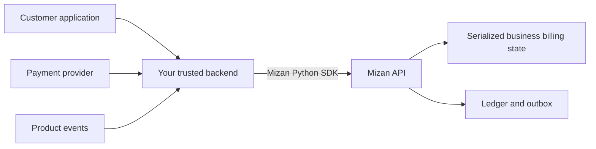
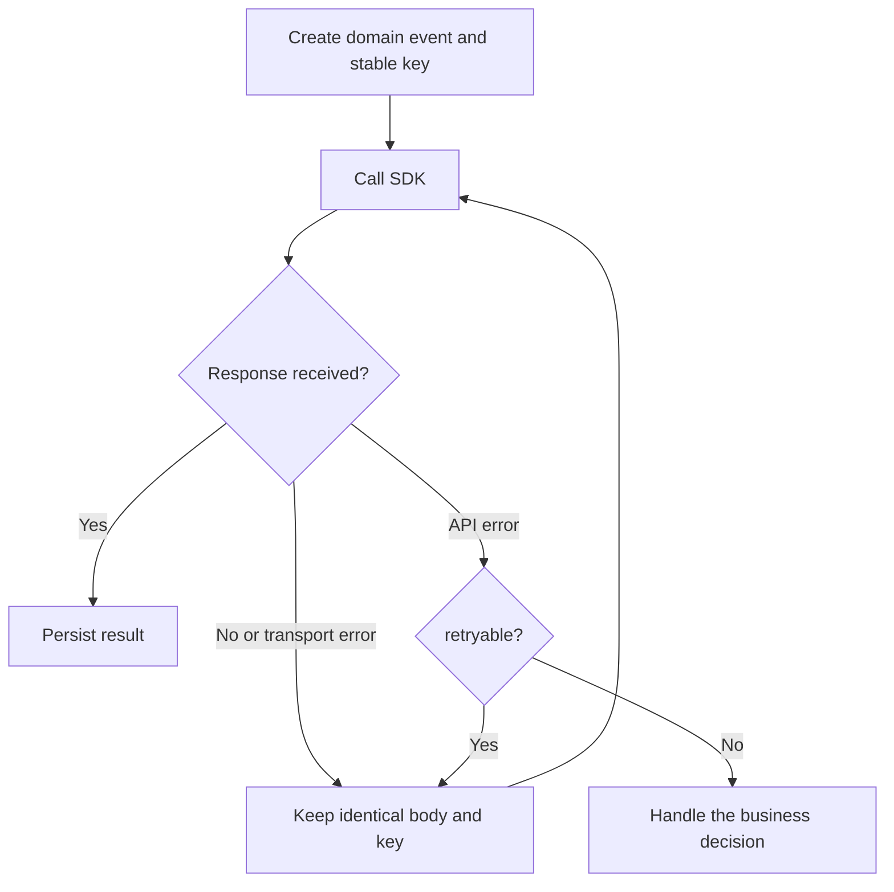
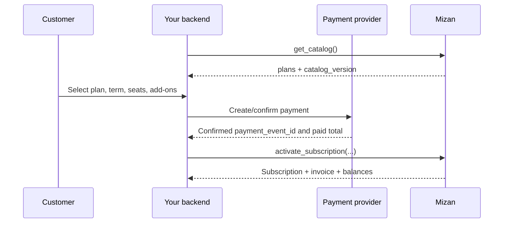
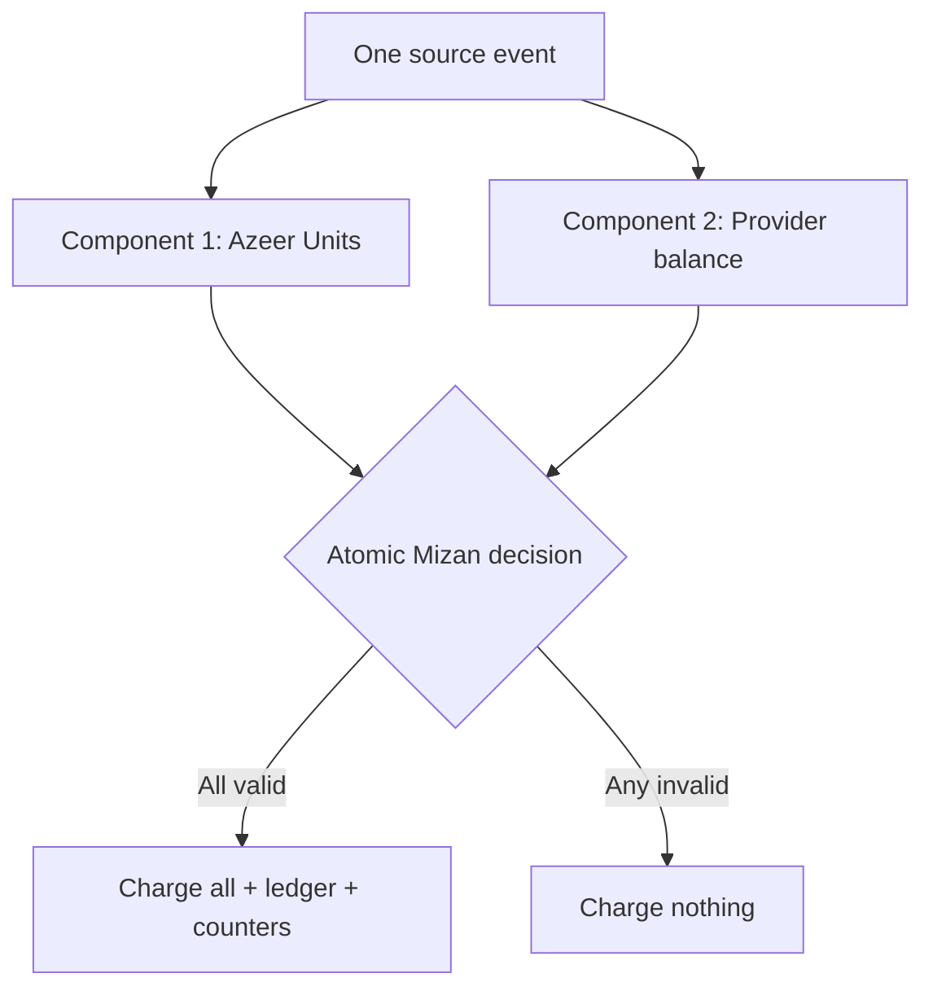
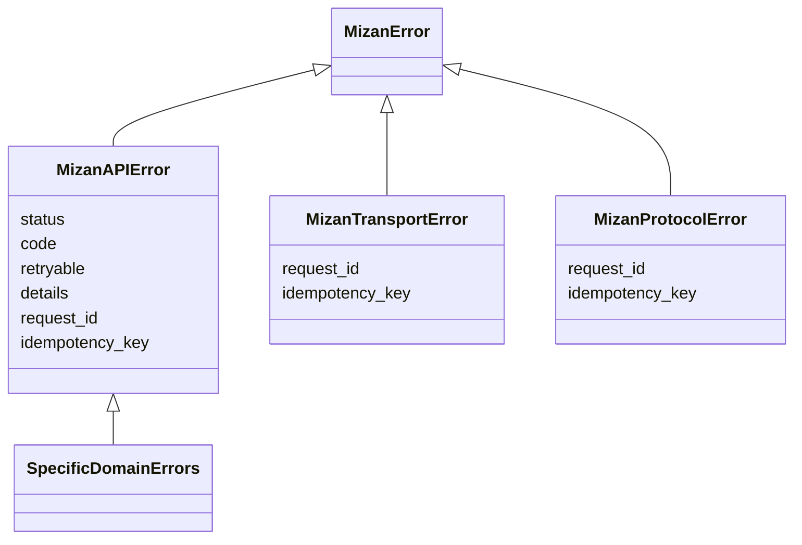

# Mizan Python SDK

The Mizan Python SDK is a typed, dependency-free client for integrating a server-side application with Mizan billing.

It helps you:

- manage subscription activation, changes, cancellation, and renewal;
- check plan entitlements and usage eligibility;
- record billable usage atomically;
- fund Azeer Units and provider balances;
- configure budgets and inspect billing history;
- safely retry uncertain mutations without charging twice;
- use documented enums instead of guessing API strings.

The package requires Python 3.10 or newer. The distribution name is `mizan-billing`; import it as `mizan`.

## Contents

- [How Mizan fits into your application](#how-mizan-fits-into-your-application)
- [Install](#install)
- [Configure the client](#configure-the-client)
- [Important concepts](#important-concepts)
- [Scenario 1: load plans and allowed values](#scenario-1-load-plans-and-allowed-values)
- [Scenario 2: activate a subscription](#scenario-2-activate-a-subscription)
- [Scenario 3: change, cancel, or renew a subscription](#scenario-3-change-cancel-or-renew-a-subscription)
- [Scenario 4: check entitlement and eligibility](#scenario-4-check-entitlement-and-eligibility)
- [Scenario 5: record usage](#scenario-5-record-usage)
- [Scenario 6: top-ups and refunds](#scenario-6-top-ups-and-refunds)
- [Scenario 7: budgets](#scenario-7-budgets)
- [Scenario 8: summaries and ledger export](#scenario-8-summaries-and-ledger-export)
- [Error handling and retries](#error-handling-and-retries)
- [Production checklist](#production-checklist)

## How Mizan fits into your application

Call Mizan from your trusted backend. Do not put the API token in browser, mobile, or customer-controlled code.



For each business, Mizan is the authoritative billing decision-maker. Your application supplies facts—such as a confirmed payment or delivered message—and Mizan decides whether the action is valid, what it costs, and which balances or records must change.

## Install

From PyPI after the package is published:

```bash
python -m pip install mizan-billing
```

From this repository:

```bash
python -m pip install ./mizan-python
```

For local SDK development:

```bash
python -m pip install --editable "./mizan-python[dev]"
```

## Configure the client

Store the base URL and API token in environment variables or a secret manager.

```python
import os

from mizan import MizanClient

client = MizanClient(
    base_url=os.environ["MIZAN_BASE_URL"],
    token=os.environ["MIZAN_API_TOKEN"],
    timeout=10.0,
    max_attempts=3,
)
```

| Option | Meaning | Recommended production value |
|---|---|---|
| `base_url` | Mizan environment URL | Environment variable |
| `token` | Bearer API token | Secret manager value |
| `timeout` | Timeout for one HTTP attempt | `10.0` seconds |
| `max_attempts` | Maximum attempts for retryable mutations | `3` |
| `logger` | Optional structured logging callback | Redacting application logger |

The client automatically sends:

- `Authorization: Bearer …`;
- `X-Request-Timestamp` for replay protection;
- `X-Request-ID` for correlation;
- `X-Business-Id` for business-scoped routes;
- `Idempotency-Key` for mutations.

### Optional structured logging

```python
import logging
from collections.abc import Mapping
from typing import Any

log = logging.getLogger("billing.mizan")

def sdk_logger(event: str, fields: Mapping[str, Any]) -> None:
    # The SDK does not place the API token or request body in these fields.
    log.info("%s %s", event, dict(fields))

client = MizanClient(
    os.environ["MIZAN_BASE_URL"],
    os.environ["MIZAN_API_TOKEN"],
    logger=sdk_logger,
)
```

## Important concepts

### Use enums, not handwritten strings

```python
from mizan import (
    BillingTerm,
    BudgetAction,
    BudgetMetric,
    Capability,
    Channel,
    FeatureCode,
    PlanId,
    RecurringAddonCode,
    values,
)

print(PlanId.START.value)                         # start
print(FeatureCode.OUTBOUND_DELIVERED_MESSAGE)     # outbound_delivered_message
print(values(BillingTerm))                        # all supported term values
```

The SDK includes enums for plans, terms, features, add-ons, currency, payment and refund statuses, budget fields, channels, capabilities, and error codes. The live catalog also returns `contract_values`, which is useful when building dynamic controls.

### Exact values

Mizan does not use JSON floating-point numbers for financial or unit balances.

| Name or suffix | Unit | Python representation | Example |
|---|---|---|---|
| `_minor` | Integer halala | `str` / `ExactAmount` | `"75"` = SAR 0.75 |
| `_millis` | Azeer milliunit | `str` / `ExactAmount` | `"500"` = 0.5 Azeer Unit |
| quantity | Exact decimal string | `str` | `"1.250"` |
| `_bps` | Basis points | `int` | `1500` = 15% |

Use `decimal.Decimal` for UI conversion when needed. Never pass exact values through `float`.

```python
from decimal import Decimal

minor = "25300"
display_sar = Decimal(minor) / Decimal(100)  # Decimal('253')
```

### Idempotency keys

Every mutation must have an idempotency key. The key identifies one business operation, not one HTTP attempt.

Good keys:

- `activate:business-123:checkout-001`
- `renew:business-123:invoice-2026-08`
- `consume:message-delivered-001`
- `provider-topup:payment-001`



If you reuse a key with a different body, Mizan returns `IDEMPOTENCY_KEY_REUSED` and does not apply the second operation.

## Scenario 1: load plans and allowed values

Fetch the catalog before presenting subscription choices or constructing an activation/change workflow.

```python
catalog = client.get_catalog()

catalog_version = catalog["catalog_version"]
plans = catalog["plans"]
terms = catalog["terms"]
addons = catalog["recurring_addons"]
allowed_features = catalog["contract_values"]["feature_codes"]

print(catalog_version)
print(plans["start"])
print(allowed_features)
```

Do not cache the catalog indefinitely. Save the returned `catalog_version` with the checkout session. Activation and subscription-change requests use it to detect stale pricing.

## Scenario 2: activate a subscription

Activation is used once for a business, after your trusted checkout flow has a confirmed payment and the exact Mizan invoice total.



```python
from mizan import (
    ActivationRequest,
    BillingTerm,
    Currency,
    PaymentStatus,
    PlanId,
)

business_id = "business-123"
payment_event_id = "checkout-session-001"

request: ActivationRequest = {
    "catalog_version": catalog["catalog_version"],
    "plan_id": PlanId.START,
    "term": BillingTerm.MONTHLY,
    "seats": 1,
    "timezone": "Asia/Riyadh",
    "payment_status": PaymentStatus.CONFIRMED,
    "payment_event_id": payment_event_id,
    "currency": Currency.SAR,
    "paid_total_minor": "25300",  # Exact authoritative checkout total.
}

response = client.activate_subscription(
    business_id,
    request,
    idempotency_key=f"activate:{business_id}:{payment_event_id}",
)

activation = response["data"]
print(activation["subscription_id"])
print(activation["invoice"]["total_minor"])
print(activation["balances"]["azeer_unit_millis"])
```

`paid_total_minor` and `currency` must match the authoritative invoice exactly. Never accept either value directly from an untrusted browser request.

When add-ons are selected, include them before creating the payment and use `RecurringAddonCode` values. The paid total must be the invoice for the plan, seats, term, and complete add-on selection.

For a reviewed business-specific plan, replace `"plan_id": PlanId.START` with
`"plan_configuration_id": "<approved immutable ID>"`. Send exactly one of these fields. Obtain the exact invoice
from the trusted admin quote flow before taking payment; never accept a plan configuration ID or paid total from
an untrusted browser.

Common activation failures:

| Error | Meaning | What to do |
|---|---|---|
| `STALE_PLAN_VERSION` | Checkout used an older catalog | Reload catalog and restart/reconfirm checkout |
| `PAYMENT_AMOUNT_MISMATCH` | Paid currency or total differs | Stop; reconcile the payment and invoice |
| `DUPLICATE_PAYMENT_EVENT` | Provider event was already used | Load existing business state; do not create another payment |
| `IDEMPOTENCY_KEY_REUSED` | Same key was used for a different request | Investigate the caller; never generate a replacement blindly |

## Scenario 3: change, cancel, or renew a subscription

### Schedule a change

V1 subscription changes take effect at renewal. They do not prorate the current period.

```python
from mizan import BillingTerm, PlanId, SubscriptionChangeRequest

change: SubscriptionChangeRequest = {
    "catalog_version": client.get_catalog()["catalog_version"],
    "plan_id": PlanId.GROWTH,
    "term": BillingTerm.ANNUAL,
    "seats": 5,
    "requested_by": "owner@example.com",
    "reason": "Annual upgrade",
}

client.change_subscription(
    business_id,
    change,
    idempotency_key="change:business-123:annual-upgrade-001",
)
```

Only one change can be pending. `SUBSCRIPTION_CHANGE_PENDING` means the existing pending change must be reviewed instead of overwritten.

### Schedule cancellation

```python
client.cancel_subscription(
    business_id,
    {
        "event_id": "customer-cancel-001",
        "reason": "Customer request",
    },
    idempotency_key="cancel:business-123:customer-cancel-001",
)
```

This preserves access until the paid period ends. Immediate cancellation is an audited admin operation, not a public SDK operation.

### Apply a failed renewal

Use the payment provider's unique event identifier.

```python
from mizan import PaymentStatus, RenewalEventRequest

failed: RenewalEventRequest = {
    "payment_event_id": "renewal-provider-event-001",
    "payment_status": PaymentStatus.FAILED,
}

client.apply_renewal_event(
    business_id,
    failed,
    idempotency_key="renew:renewal-provider-event-001",
)
```

A failed renewal moves the subscription to `past_due`. Do not invent currency or paid-total values for a failed payment.

### Apply a confirmed renewal

```python
from mizan import Currency

confirmed: RenewalEventRequest = {
    "payment_event_id": "renewal-provider-event-002",
    "payment_status": PaymentStatus.CONFIRMED,
    "currency": Currency.SAR,
    "paid_total_minor": "25300",
}

client.apply_renewal_event(
    business_id,
    confirmed,
    idempotency_key="renew:renewal-provider-event-002",
)
```

The total must match the renewal invoice, including any scheduled plan, term, seat, or add-on change.

## Scenario 4: check entitlement and eligibility

Entitlement and eligibility answer different questions.

| Check | Question answered | Changes state? | Use it for |
|---|---|---:|---|
| `get_entitlement` | Does this subscription include a capability? | No | Showing/enabling product features |
| `check_eligibility` | Would this specific usage likely be allowed now? | No | UI preflight before starting work |
| `consume` | Is this usage allowed, and should it be charged now? | Yes | Authoritative billable event |

### Entitlement

```python
from mizan import Capability

result = client.get_entitlement(business_id, Capability.ADVANCED_ANALYTICS)

if result["data"]["enabled"]:
    enable_advanced_analytics = True
```

### Eligibility preview

```python
from mizan import Channel, FeatureCode

preview = client.check_eligibility(
    business_id,
    FeatureCode.OUTBOUND_DELIVERED_MESSAGE,
    {
        "quantity": "1",
        "metadata": {"channel": Channel.WHATSAPP},
    },
)

if not preview["data"]["eligible"]:
    print(preview["data"]["reason"])
```

Eligibility expires quickly and reserves nothing. Always call `consume` when the billable work actually occurs.

## Scenario 5: record usage

### One feature

```python
from datetime import datetime, timezone

from mizan import Channel, ConsumptionRequest, FeatureCode

source_event_id = "message-delivered-001"

usage: ConsumptionRequest = {
    "source_event_id": source_event_id,
    "occurred_at": datetime.now(timezone.utc).isoformat(),
    "feature_code": FeatureCode.OUTBOUND_DELIVERED_MESSAGE,
    "quantity": "1",
    "metadata": {
        "channel": Channel.WHATSAPP,
        "provider": "meta",
        "provider_event_id": "meta-message-001",
        "conversation_id": "conversation-123",
    },
}

decision = client.consume(
    business_id,
    usage,
    idempotency_key=f"consume:{source_event_id}",
)

print(decision["data"]["accepted"])
print(decision["data"]["charges"])
print(decision["data"]["balances"])
```

Choose `source_event_id` from the event in your own system. It is a second deduplication boundary in addition to the HTTP idempotency key.

### Multiple components in one event

Use components when a single product event creates several related charges. Mizan accepts or rejects all components together.

```python
multi_component: ConsumptionRequest = {
    "source_event_id": "campaign-delivery-001",
    "occurred_at": datetime.now(timezone.utc).isoformat(),
    "components": [
        {
            "feature_code": FeatureCode.OUTBOUND_DELIVERED_MESSAGE,
            "quantity": "1",
            "metadata": {
                "channel": Channel.WHATSAPP,
                "provider_event_id": "meta-delivery-001",
            },
        },
        {
            "feature_code": FeatureCode.WHATSAPP_META_MARKETING_MSG,
            "quantity": "1",
            "provider_amount_minor": "25",
            "metadata": {
                "channel": Channel.WHATSAPP,
                "provider_event_id": "meta-charge-001",
            },
        },
    ],
}

client.consume(
    business_id,
    multi_component,
    idempotency_key="consume:campaign-delivery-001",
)
```



Metadata is for traceability and deduplication. Use enum-backed `channel` values and stable provider event IDs. Do not place secrets or unrestricted payloads in metadata.

## Scenario 6: top-ups and refunds

Mizan has two financial rails:

| Rail | Pays for | Typical operation |
|---|---|---|
| Azeer Units | Mizan-metered product usage | `top_up_azeer_units` |
| Provider balance | Third-party/provider charges | `top_up_provider_balance` |

### Confirmed top-up

The builder fills the fixed confirmed status and SAR currency. You still supply the authoritative principal and paid total.

```python
from mizan import confirmed_top_up

top_up = confirmed_top_up(
    amount_minor="10000",
    payment_event_id="provider-payment-001",
    paid_total_minor="11500",
)

client.top_up_provider_balance(
    business_id,
    top_up,
    idempotency_key="provider-topup:provider-payment-001",
)
```

Use the same request with `top_up_azeer_units` only when `amount_minor` is one of the catalog's supported unit top-up packages.

### Confirmed provider refund

```python
from mizan import confirmed_refund

refund = confirmed_refund(
    amount_minor="1000",
    payment_event_id="provider-refund-001",
    reason="Unused provider funds",
)

client.refund_provider_balance(
    business_id,
    refund,
    idempotency_key="provider-refund:provider-refund-001",
)
```

A refund creates an immutable reversal. It does not edit the original top-up.

## Scenario 7: budgets

Budgets apply to one feature for one subscription month.

| Metric | Measures | Typical feature |
|---|---|---|
| `AZEER_UNIT_MILLIS` | Azeer milliunits | Unit-priced feature |
| `MONEY_MINOR` | Integer halala | Provider-priced feature |
| `QUANTITY` | Exact event quantity | Count-based limit |

| Action | Behavior at the limit |
|---|---|
| `ALERT` | Record/report the breach but allow usage |
| `PAUSE` | Reject the crossing usage and pause the feature |

```python
from mizan import BudgetAction, BudgetMetric, FeatureCode, feature_budget

budget = feature_budget(
    metric=BudgetMetric.AZEER_UNIT_MILLIS,
    limit="500000",
    warning_bps=8000,  # Warn at 80%.
    action=BudgetAction.PAUSE,
)

client.set_feature_budget(
    business_id,
    FeatureCode.OUTBOUND_DELIVERED_MESSAGE,
    budget,
    idempotency_key="budget:business-123:outbound-delivered-message:v1",
)
```

For sensitive provider-priced features, set `sensitive=True` and use the complete `BudgetRequest` type when reserve fields are required.

## Scenario 8: summaries and ledger export

### Billing summary

```python
summary = client.get_billing_summary(business_id)["data"]

print(summary["subscription"])
print(summary["balances"])
print(summary["credit_lots"])
print(summary["budgets"])
print(summary["replication"])
```

Use the summary for customer billing screens and support views. Do not reconstruct current balances by replaying ledger entries in the request path.

### Ledger pagination

```python
after = 0

while True:
    page = client.get_ledger(
        business_id,
        after_sequence=after,
        limit=100,
    )["data"]

    for entry in page["entries"]:
        export_entry(entry)

    next_after = page.get("next_after_sequence")
    if not next_after or next_after == after:
        break
    after = next_after
```

Persist the last successfully processed sequence in your downstream system. This makes exports and replication restartable.

## Error handling and retries

### Error classes



| Exception | Meaning | Recommended handling |
|---|---|---|
| `MizanAPIError` | Mizan returned a structured API/domain error | Inspect `code`, `details`, and `retryable` |
| Specific error from `mizan.errors` | A known error code with a Python class | Handle the scenario directly |
| `MizanTransportError` | Network outcome is unknown | Retry identical mutation using the same key |
| `MizanProtocolError` | Response was invalid or exceeded 2 MiB | Preserve key, alert, and investigate |

```python
from mizan import MizanAPIError, MizanProtocolError, MizanTransportError
from mizan.errors import (
    FeaturePausedBudgetError,
    InsufficientAzeerUnitsError,
    InsufficientProviderBalanceError,
    PaymentAmountMismatchError,
)

try:
    result = client.consume(
        business_id,
        usage,
        idempotency_key=f"consume:{source_event_id}",
    )
except InsufficientAzeerUnitsError:
    show_customer_top_up_required()
except InsufficientProviderBalanceError:
    pause_provider_work_and_notify_finance()
except FeaturePausedBudgetError:
    show_budget_limit_reached()
except PaymentAmountMismatchError as error:
    alert_payment_reconciliation(error.request_id, error.details)
except MizanAPIError as error:
    if error.retryable:
        schedule_identical_retry(error.idempotency_key)
    else:
        record_business_failure(error.code, error.details, error.request_id)
except MizanTransportError as error:
    # The request may already have committed. Never create a new key/body.
    schedule_identical_retry(error.idempotency_key)
except MizanProtocolError as error:
    alert_integration_failure(error.request_id, error.idempotency_key)
```

The SDK automatically retries only retryable mutation failures and transport failures, up to `max_attempts`. Read-only requests are not retried after an uncertain transport failure by default.

### Common error decisions

| Error code | Retry unchanged? | Typical response |
|---|---:|---|
| `INTERNAL_RETRYABLE` | Yes | Allow SDK retry; alert if exhausted |
| `DEPENDENCY_TEMPORARILY_UNAVAILABLE` | Yes, when marked retryable | Back off and retry with same key |
| `INVALID_REQUEST` | No | Fix caller validation |
| `PAYMENT_AMOUNT_MISMATCH` | No | Reconcile invoice/payment |
| `INSUFFICIENT_AZEER_UNITS` | No | Ask customer to top up |
| `INSUFFICIENT_PROVIDER_BALANCE` | No | Fund provider balance |
| `FEATURE_PAUSED_BUDGET` | No | Review/increase budget or wait for reset |
| `STALE_PLAN_VERSION` | No | Reload catalog and restart checkout/change |
| `IDEMPOTENCY_KEY_REUSED` | No | Investigate conflicting requests |

## Method reference

| SDK method | Use it when | Mutation? |
|---|---|---:|
| `get_catalog` | Loading commercial choices and allowed values | No |
| `activate_subscription` | Creating the first paid subscription | Yes |
| `change_subscription` | Scheduling a next-renewal change | Yes |
| `cancel_subscription` | Scheduling period-end cancellation | Yes |
| `apply_renewal_event` | Processing a confirmed/failed renewal event | Yes |
| `top_up_azeer_units` | Purchasing a catalog unit package | Yes |
| `top_up_provider_balance` | Funding third-party costs | Yes |
| `refund_provider_balance` | Recording a confirmed provider refund | Yes |
| `set_feature_budget` | Setting monthly alert/pause behavior | Yes |
| `check_eligibility` | Previewing whether usage is currently possible | No |
| `get_entitlement` | Checking a plan capability | No |
| `consume` | Recording the authoritative billable event | Yes |
| `get_billing_summary` | Rendering current account state | No |
| `get_ledger` | Exporting immutable financial history | No |

All public request and response types are exported from `mizan`. The package includes `py.typed` for type checkers.

## Production checklist

- [ ] Call the SDK only from trusted server-side code.
- [ ] Keep the token in a secret manager and use separate tokens per environment.
- [ ] Fetch and persist `catalog_version` for checkout/change workflows.
- [ ] Use SDK enums or live `contract_values`; do not invent strings.
- [ ] Keep money and Azeer values as exact strings.
- [ ] Derive stable idempotency keys from domain events and persist them.
- [ ] Retry mutations only with the identical body and key.
- [ ] Use provider/source event IDs for deduplication and reconciliation.
- [ ] Treat eligibility as advisory; use consumption for the final decision.
- [ ] Log `request_id`, business ID, operation, and idempotency key—never the token.
- [ ] Alert on exhausted retryable errors, protocol errors, and replication lag.
- [ ] Test insufficient balance, duplicate event, stale catalog, and timeout scenarios.

## Test and build the SDK

```bash
python -m pip install --editable ".[dev]"
python -m pytest
python -m mypy src
python -m build
python -m twine check dist/*
```
